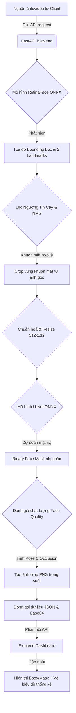

# AI Crowd Face Surveillance Console (Hệ Thống Giám Sát Khuôn Mặt AI)

Dự án này là một hệ thống Giám sát Khuôn mặt Đám đông thông minh (AI CCTV Console) được phát triển phục vụ cho các kịch bản an ninh công cộng. Ứng dụng thực hiện đồng thời hai bài toán thị giác máy tính cốt lõi: **Phát hiện khuôn mặt đám đông (Face Detection)** và **Phân vùng khuôn mặt (Face Segmentation)** sử dụng các công nghệ trí tuệ nhân tạo tiên tiến.

---

## Các Tính Năng Nổi Bật

1. **Nhận diện khuôn mặt đám đông (RetinaFace ONNX):** Định vị chính xác tọa độ bounding box và 5 điểm landmarks (mắt, mũi, miệng) của nhiều đối tượng trong cảnh đông người.
2. **Phân vùng chi tiết vùng mặt (U-Net ONNX):** Cắt và tạo lớp phủ mặt nạ phân vùng (Face Mask) sắc nét bao quanh khuôn mặt dựa trên mô hình U-Net huấn luyện với bộ dữ liệu CelebAMask-HQ.
3. **Đánh giá chất lượng khuôn mặt (Face Quality Analytics):** Tự động tính toán độ che khuất (Occlusion) và ước lượng hướng quay đầu (Head Pose: Trái, Phải, Ngửa, Cúi, Thẳng) dựa trên hình học landmarks và tỉ lệ mặt nạ.
4. **Giao diện Modern Glassmorphism Dashboard:** Thiết kế giao diện mô phỏng phòng điều khiển an ninh cao cấp với hiệu ứng mờ kính cường lực, viền neon phát sáng và hiệu ứng quét camera.
5. **Biểu đồ thống kê thời gian thực (ApexCharts.js):**
   * Biểu đồ tròn hiển thị tỉ lệ phân bổ chất lượng (Excellent, Good, Acceptable, Poor, Unusable).
   * Biểu đồ cột ngang hiển thị phân tích góc quay đầu (Head Pose).
   * Biểu đồ đường vẽ lịch sử biến động số lượng mục tiêu trong khung nhìn.
6. **Nhật ký & Âm thanh cảnh báo (Audio Alerts):** Phát âm thanh cảnh báo tần số cao (tiếng bíp) khi phát hiện mật độ đám đông vượt ngưỡng hoặc phát hiện đối tượng che mặt/nghi vấn.
7. **Lưu trữ bằng chứng (Evidence Snapshot):** Hỗ trợ chụp và tải xuống hồ sơ bằng chứng đầy đủ cho từng đối tượng (gồm ảnh toàn cảnh, ảnh chân dung cắt nền trong suốt chứa kênh alpha mặt nạ, mặt nạ nhị phân và file thông số JSON).

---

## Cấu Trúc Mã Nguồn

Dự án được thiết kế theo cấu trúc Modular sạch sẽ, phân tách rõ ràng giữa Backend (FastAPI phục vụ logic AI) và Frontend (giao diện điều khiển tĩnh):

```text
/ (Thư mục gốc)
├── backend/
│   ├── main.py               # Máy chủ FastAPI chính & các API Endpoints
│   ├── data/                 # Chứa cấu hình và nạp dữ liệu RetinaFace
│   │   └── config.py         # Cấu hình kiến trúc mạng RetinaFace (MNet, ResNet)
│   ├── models/               # Bộ điều khiển (Wrappers) suy luận mô hình
│   │   ├── face_detector.py  # Wrapper chạy RetinaFace ONNX & Hậu xử lý hình học
│   │   └── face_segmenter.py # Wrapper chạy U-Net ONNX & Tiền xử lý
│   ├── quality/              # Đánh giá chất lượng khuôn mặt
│   │   ├── alert.py          # Logic hỗ trợ gửi cảnh báo
│   │   ├── face_quality.py   # Phân tích Occlusion và Head Pose hình học
│   │   └── logger.py         # Trích xuất lịch sử hoạt động hệ thống
│   ├── segmentation/         # Mã nguồn gốc PyTorch U-Net (huấn luyện/cấu hình)
│   │   ├── config.py         # Cấu hình các lớp phân vùng da mặt & ngũ quan
│   │   ├── model.py          # Định nghĩa kiến trúc mạng PyTorch U-Net
│   │   └── postprocess.py    # Chuyển đổi Logits sang nhãn mặt nạ nhị phân
│   └── weights/              # Nơi lưu trữ file trọng số (.pth và .onnx)
│
├── frontend/                 # Giao diện an ninh tĩnh được serve bởi FastAPI
│   ├── index.html            # Giao diện Web Dashboard (Glassmorphism layout)
│   ├── css/
│   │   └── style.css         # CSS định kiểu giao diện hiện đại & Neon HUD
│   └── js/
│       └── app.js            # Logic webcam loop, biểu đồ động ApexCharts & âm thanh
│
├── export_onnx.py            # Script xuất các mô hình .pth sang mô hình tăng tốc .onnx
├── requirements.txt          # Khai báo các thư viện Python phụ thuộc
└── run.py                    # Script chạy nhanh hệ thống (kích hoạt backend/main.py)
```

---

## Luồng Xử Lý Logic & Trí Tuệ Nhân Tạo (Logic + AI)

Dưới đây là sơ đồ luồng xử lý dữ liệu hình ảnh của hệ thống từ lúc nhận dữ liệu camera cho đến khi phân tích chất lượng khuôn mặt và hiển thị lên giao diện giám sát:



Các bước xử lý cụ thể bao gồm:
1. **Phát hiện khuôn mặt (RetinaFace):** Mô hình RetinaFace ONNX nhận dạng các vùng mặt trong đám đông, trả về tọa độ và các điểm định vị. Thuật toán NMS (Non-Maximum Suppression) sẽ lọc bỏ các hộp bao trùng lặp bao quanh cùng một khuôn mặt.
2. **Phân vùng khuôn mặt (U-Net):** Từng khuôn mặt phát hiện được crop ra, đưa qua mạng U-Net ONNX để dự đoán phân lớp 19 bộ phận khuôn mặt (da, tóc, ngũ quan...). Các bộ phận cấu thành mặt (13 lớp da mặt và ngũ quan từ lớp 1 đến lớp 13) được gộp lại thành mặt nạ nhị phân (Binary Face Mask).
3. **Đánh giá chất lượng (Telemetry):** Tính toán độ che khuất (Occlusion) và góc xoay đầu (Head Pose) dựa trên hình học từ landmarks và mặt nạ phân vùng.
4. **Hiển thị & Thống kê:** Backend trả dữ liệu JSON và ảnh cắt chân dung (dưới dạng Base64 chứa kênh Alpha) để Frontend render trực tiếp lên Canvas và cập nhật các biểu đồ thống kê thời gian thực.

---

## 🛠️ Hướng Dẫn Cài Đặt & Chạy Dự Án (Local)

### 1. Yêu cầu hệ thống
* Đã cài đặt Python từ phiên bản 3.8 đến 3.12.
* Webcam kết nối với máy tính (nếu muốn sử dụng tính năng live stream trực tuyến).

### 2. Cài đặt các thư viện phụ thuộc
Mở terminal tại thư mục gốc của dự án và chạy lệnh sau để cài đặt môi trường:
```bash
pip install -r requirements.txt
```
*(Ghi chú: Quá trình suy luận mô hình chính (Inference) đã được chuyển giao cho ONNX Runtime giúp tăng tốc độ xử lý trên CPU từ 2-3 lần. Tuy nhiên, hệ thống vẫn duy trì thư viện PyTorch trong `requirements.txt` để hỗ trợ giải mã hình học tọa độ khuôn mặt thừa kế và phục vụ các công cụ chuyển đổi).*

### 3. Xuất mô hình sang định dạng ONNX
Để tăng hiệu năng và giảm thiểu RAM tiêu thụ, bạn cần chạy script chuyển đổi mô hình PyTorch gốc (`.pth`) sang ONNX (`.onnx`):
```bash
python export_onnx.py
```
Sau khi chạy xong, các mô hình ONNX sẽ tự động được lưu vào thư mục `backend/weights/`. Bạn chỉ cần thực hiện bước này **một lần duy nhất**.

### 4. Khởi chạy Server
Chạy lệnh sau tại thư mục gốc để khởi động máy chủ FastAPI:
```bash
python run.py
```
Màn hình console hiển thị log sau là server đã khởi động thành công:
```text
INFO:     Started server process [14504]
INFO:     Uvicorn running on http://0.0.0.0:5000 (Press CTRL+C to quit)
```
*(Hệ thống sử dụng cổng **5000** mặc định phục vụ đồng thời cả API backend và serve tài nguyên tĩnh frontend).*

### 5. Truy cập giao diện
Mở trình duyệt web của bạn và truy cập địa chỉ:
👉 **`http://127.0.0.1:5000`**

---

## 📖 Hướng Dẫn Sử Dụng Giao Diện

1. **Chọn nguồn dữ liệu:** Tại bảng điều khiển bên phải, chọn nguồn camera tương ứng:
   * *Tải ảnh tĩnh:* Chọn một bức ảnh chụp đám đông có sẵn để xem kết quả tức thì.
   * *Tải video:* Tải lên file video ngắn, video sẽ tự phát và nhận diện từng khung hình.
   * *Webcam trực tiếp:* Sử dụng camera máy tính của bạn để nhận diện thời gian thực.
2. **Cấu hình hiển thị:** Bật/tắt các checkbox tùy chọn hiển thị HUD (Bounding Box, Landmarks, Lớp phủ mặt nạ, Tên ID, Điểm tin cậy, Trạng thái chất lượng) trực tiếp trên camera.
3. **Thanh trượt ngưỡng tin cậy:** Kéo thanh trượt để thay đổi ngưỡng lọc đối tượng (Confidence). Các khuôn mặt có độ tin cậy thấp hơn ngưỡng sẽ tự động bị ẩn đi.
4. **Chọn mô hình AI:** Chuyển đổi linh hoạt giữa backbone MobileNet (nhanh, mượt) và ResNet50 (chính xác cao cho đám đông dày đặc).
5. **Chụp Evidence (Snapshot):** Click vào một khuôn mặt bất kỳ ở thanh Gallery phía dưới để khóa mục tiêu (Focus), sau đó nhấn nút "Chụp Evidence" để tự động tải về đầy đủ hồ sơ bằng chứng của mục tiêu đó.
